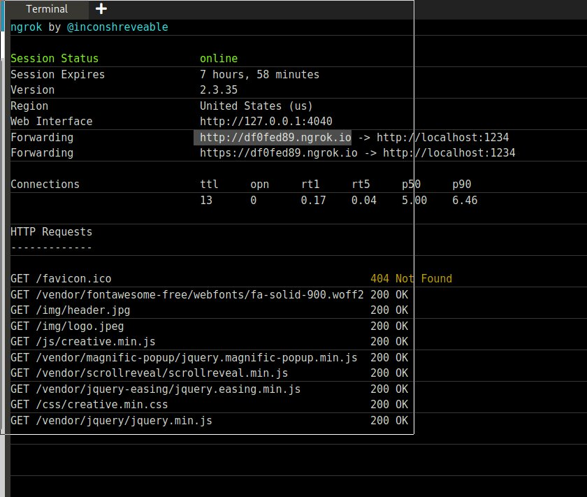

## In this project i  deploy my website on the top of Docker container and i create  Dockerfile for creating custom Docker image 

## First of all i craete one webcode  directory on my local system in which i upload my website content  and one Dockerfile create

## WEBCODE directory ( Website content )

## Dockerfile (Create custom image using docker file )

#### FROM -> keyword pull(download ) the httpd image from hub.docker.com site
#### MAINTAINER -> INFORMATION of Docker file creater in case i put only my name
#### COPY -> Work like cp command on linux system . here my webcode directory content copy on the httpd image /usr/local/apache2/htdocs directory
#### EXPOSE -> This use for connect the website outside world. i use port 80 bcz defualt port for http is 80.

## I create my project on the local system so i want to deploy on the github for access to anywhere in world.
### So local directory create a repo .
### git init (for crate local repo)
### git add . (for Tracking local directory )
### git commit . -m "webserver" (for local version control )

### Create github empty repo

### Remote add local directory so run below command 

###  git push -u vishnupal master (for upload the project on github)

### After push command github repo

### For Creating a custom image using Dockerfile so i use kotacoda website 
### https://www.katacoda.com/courses/container-runtimes/what-is-a-container
### Below command build a custom image and image name is vishnupal:v1 and i give the my github repo url . it run the Dockerfile instruction and create a docker custon image according to my requirement.

### After run docker build command it pull httpd and create a custom image top of htttpd docker image.

### Run docker container using vishnupal:v1 image. and -p for PAT (expose the port 80).

#### wget https://bin.equinox.io/c/4VmDzA7iaHb/ngrok-stable-linux-amd64.zip
### unzip ngrok-stable-linux-amd64.zip
### Run ngrok on kotacoda site

## Access the site using ngrok link .
### web browser

## Access the site using ngrok link(i change the url )
### mobile browser

